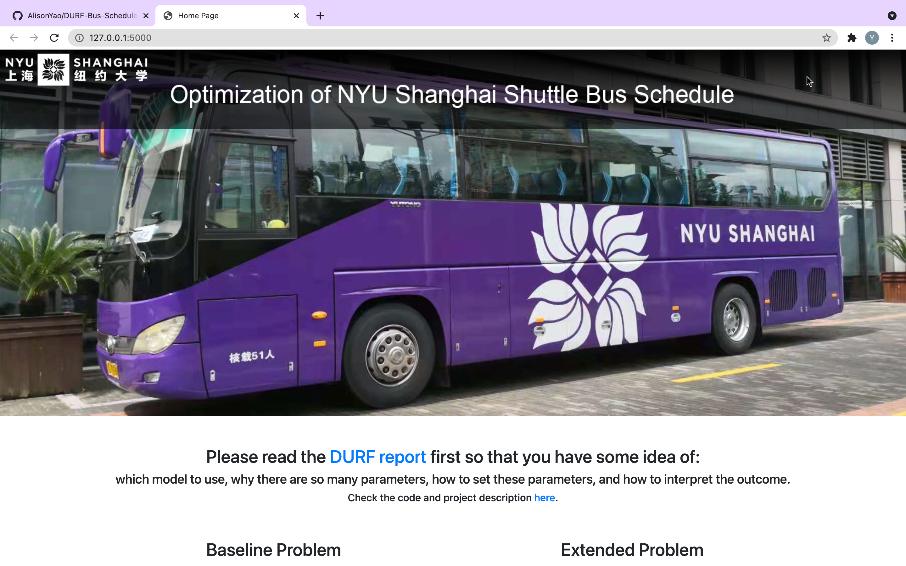
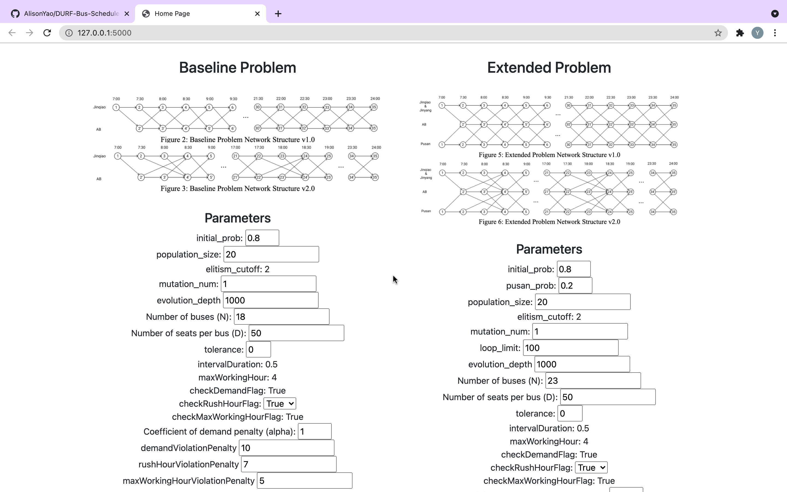
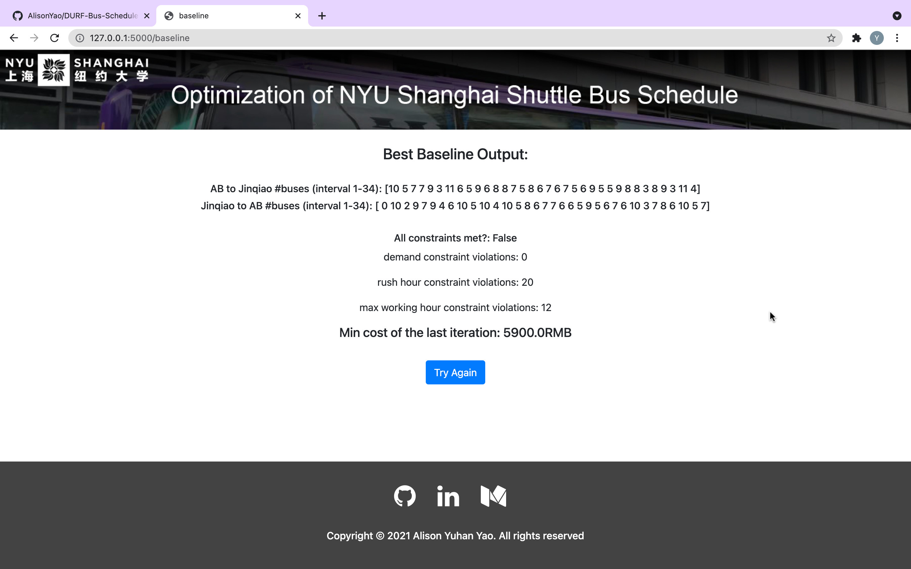

# DURF-Bus-Schedule-Optimization

Building on our [final project](https://github.com/AlisonYao/Optimization-Final-Project) for the course **Intro to Optimization and Mathematical Programming**, we extended our problem settings to be closer to real-life scenarios. We used Genetic Algorithm to further optimized the NYU Shanghai shuttle bus schedules.

Special thanks to Professor Zhibin Chen, the supervisor of this research project, for offering us guidance along the way and Dean's Undergraduate Research Fund (DURF) for generously providing us research funding.

## DURF Report

The research outcome is presented in the form of a report. Please see `DURF_report.docx`.

## Webapp

`webapp` directory is a Python Flask app where you can play with the application in your local host. Make sure you have Python and all the packages in `requirements.txt` installed.

1. Clone this GitHub repo to your preferred directory

```console
git clone https://github.com/AlisonYao/DURF-Bus-Schedule-Optimization.git
```

2. Go to `webapp`

```console
cd webapp
```

3. Run app

```console
FLASK_APP=init.py flask run
```

4. Click open the URL below

```console
* Debug mode: off
* Running on http://127.0.0.1:5000/ (Press CTRL+C to quit)
```

5. You should see a window like this:



6. Scroll down and make your own changes. You can either choose to solve either the baseline problem or the extended problem.



7. Click the Submit button at the bottom, then you should see the results!



## Codes for Genetic Algorithm

Baseline problem solution: please see `baseline_solution.py` code

Extended problem solution: please see `extension_solution.py` code

The file Genetic Algorithm has all of my codes in progress.

- `toy_GA_example.py` contains the YouTube tutorials I followed to learn GA.
- `baseline.py` is the first attempt at solving the **baseline problem**. I enforced the demand constraint as a requirement, rather than a penalty. This version is significantly slower to run because its one iteration could take the time of 50 iterations, only because the first 49 times failed to meet the demand constraint. Although the solutions are guaranteed to met the demand, it performs poorly.
- `baseline_v2.py` is the successful second attempt at the **baseline problem** where I converted the demand constraint into penalty. Although meeting the demand is not guaranteed at first, the solution will eventually satify demand over time. Same with the rush hour constraint and the max working hour constraint. `baseline_solution.py` is the duplicate of this file.
- `extension.py` is a failed first attempt at the **extended problem**.
- `extension_v2.py` is a successful solution to the **extended problem**. `extended_solution.py` is the duplicate of this file.
- `hpc_shuttle_v2.py` just outputs results into txt files.
- `temp.py` is just a file for testing that doesn't have anything important.

<!-- ## Blogs -->
